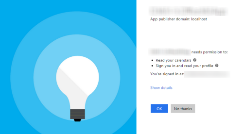

# Microsoft Graph 'a başlangıç
Bu lab örneğinde , Microsoft Graph ile ilk projenizi geliştireceksiniz.

## Gereksinimler
1. Bu lab'ı test edebilmeniz için Office 365 tenantına ihtiyacınız vardır. Eğer bir hesabınız yoksa [**Office 365 için geliştirme ortamı oluşturma linkini**](https://github.com/OfficeDev/TrainingContent/blob/master/O3651/O3651-7%20Setting%20up%20your%20Developer%20environment%20in%20Office%20365/Lab.md) kontrol edebilirsiniz.

## Adım 1:  Bir MVC Web Uygulaması Oluşturma ve Konfigüre etme
Bu adımda, bir MVC web uygulaması oluşturup onu Microsoft Graph ile bağlamayı göreceksiniz.

1. Visual Studio'dan, **File/New/Project** seçin.
1. **New Project** 'i seçin
  1. **Templates/Visual C#/Web** 'i seçin.
  1. **ASP.NET Web Application** 'ı seçin.

    
    > **Not:** Projenizi olutşururken bu lab içerisindeki isimlerin aynısını vermeye dikkat edin. The Visual Studio Project adı projenin kodu içerisinde namespace olacaktır. Bu adımlardaki kodların tamamı namespace ile ilişkili olacağı için kodunuzun çalışmasına da etkili olacaktır. Eğer farklı bir proje adı verirseniz namespace'ler farklı olacağından buradaki örnek kodlar çalışmayacaktır.
  1. **OK** Tıklayın.
  
1.  **New ASP.NET Project** dialogu içerisinden
  1. **MVC** 'yi seçin.
  2. **Change Authentication** 'ı seçin.
  3. **Work And School Accounts** 'ı seçin.
  4. **Cloud - Single Organization** 'ı seçin
  5. **Domain** adınızı girin
  6. Directory Access Permissions altındaki **Read directory data** seçeneğini seçin.  
  7. **OK** 'i tıklayın.
  8. **Host in the cloud** seçeniğini kaldırın.
  9. **OK** 'İ tıklayın.

    

    

1.  SSL'i default olarak kullanmak için web projesini aşağıdaki şekilde update edin :
  1. **Solution Explorer** bölümündeki araçlar penceresinde, projeyi seçin ve **Properties** araç ekranına bakın. 
  1. **SSL Enabled** özelliğini **TRUE** olarak değiştirin.
  1. **SSL URL** değerini bir sonraki adımlarda kullanmak için kopyalayın.
  1. Değişikliklerinizi kaydedin.

    
    
    > Bu aşama önemli çünkü Azure AD üzerinde bir application oluşturduğunuzda ona HTTPS kullarak dönüş yapmanız gerekmektedir. Eğer bu değişiliği bu aşamada gerçekleştirmediyseniz, Visual Studio wizard kullanarak yapabilir ve sizin adınıza gerekli konfigürasyonları gerçekleştirebilir.
    
1. Debug ederken her zaman anasayfanıza gitmesini sağlamak için projenizi konfigure edebilirsiniz:
  1. **Solution Explorer** araç penceresi içerisinden **Properties** 'i seçin.
  1. Sol taraftaki **Web** 'i seçin.
  1. **Start Action** bölümüne gidin.
  1. **Start URL** olan radio buttonuna tıklayın ve daha önceki adımlarda kopyalamış olduğunuz web projenize ait olan SSL URL adresini yapıştırın.
  
1. Şu an ki noktada, uygulamanızın Authentication akışını test edebilirsiniz.
  1. Visual Studio içerisinde, **F5** 'e basın. Browser otomatik olarak çalışarak HTTPS başlangıç sayfanıza gidecektir.

   > **Not:** Eğer "ASP.NET could not connect to the SQL database" hatası alırsanız lütfen [SQL Server Database Connection Error Resolution document](https://github.com/OfficeDev/TrainingContent/blob/master/SQL-DB-Connection-Error-Resolution.md) dökümanını inceleyerek çözüm getirebilirsiniz.. 

  1. Sign-in olabilmek için, sağ üst köşedeki **Sign In** işaretini tıklayın.
  1. **Organizational Account** ile O365 kurum hesabınızı kullanarak login olabilirsiniz.
  1. Başarılı bir login gerçekleştirebilmek için, ilk defa sign-in olmaya çalışırken, Azure AD  sizlere tüm login sayfalarında ortak olarak görebileceğiniz aşağıdaki ekranı görebileceksiniz:
    
    

  1. Office 365'deki bilgilerinize erişimi isteyen bu yetki diyalogunda **Accept** buttonunu tıklayarak gerekli yetki izinlerini kabul edebilirsiniz.
  1. Daha sonrasında web uygulamanıza geri yönlendirileceksiniz. Dikkat etmeniz gereken nokta ise sağ üst köşede e-mail adresiniz ve **Sign Out** linkinin belirdiğini göreceksiniz.

Tebrikler... şu ana kadar başarılı bir şekilde Azure AD ve OpenID Connect ve OWIN kullanarak login olmayı başardınız!


## Adım 2:Azure AD ve OWIN'i kullanabilmek için, Web Uygulamanızı konfigure edin.
In this exercise you will take the ASP.NET MVC web application you created in the previous exercise and configure it to use Azure AD & OpenID Connect for user & app authentication. You will do this by utilizing the OWIN framework. Once authenticated, you can use the access token returned by Azure AD to access the Microsoft Graph.


1. Grant App Necessary Permissions.

  1. Browse to the [Azure Management Portal](https://manage.windowsazure.com) and sign in with your **Organizational Account**.
  
	> **Note:** If the Azure Management Portal pops up a message asking if you want to navigate to the updated Azure Management Portal answer no.
	 
  1. In the left-hand navigation, click **Active Directory**.
  1. Select the directory you share with your Office 365 subscription.
  1. Locate and select the **Application** tab on the header/options bar.
  1. Select the application you created for this lab.
  1. Open **Configure** tab
  1. Scroll down to the **permissions to other applications** section. 
  1. Click the **Add Application** button.
  1. In the **Permissions to other applications** dialog, click the **PLUS** icon next to the **Microsoft Graph** option.
  1. Click the **CHECK** icon in the lower right corner.
  1. For the new **Microsoft Graph** application permission entry, select the **Delegated Permissions** dropdown on the same line and then select the following permissions:
    * **Read user calendars**    
  1. Click the **Save** button at the bottom of the page.

     
1. Add a helper class that will be used to harvest settings out of the `web.config` and create the necessary strings that will be used for authentication:

  1. Right-click the project and select **Add/New Folder**. Give the folder the name **Utils**. 
  1. Locate the [\\\O3651\O3651-5 Getting started with Office 365 APIs\Lab\Lab Files](/O3651/O3651-5 Getting started with Office 365 APIs/Lab Files) folder provided with this lab and find the [`SettingsHelper.cs`](/O3651/O3651-5 Getting started with Office 365 APIs/Lab Files/SettingsHelper.cs) file.  Drag the [`SettingsHelper.cs`](/O3651/O3651-5 Getting started with Office 365 APIs/Lab Files/SettingsHelper.cs) file to the **Utils** folder in the project.
      
1. Update **_Layout** file to add **Calendar** link:
    1. Open the **_Layout.cshtml** file found in the **Views/Shared** folder.
      1. Locate the part of the file that includes a few links at the top of the page... it should look similar to the following code:
      
        ````asp
        <div class="navbar-collapse collapse">
          <ul class="nav navbar-nav">
            <li>@Html.ActionLink("Home", "Index", "Home")</li>
            <li>@Html.ActionLink("About", "About", "Home")</li>
            <li>@Html.ActionLink("Contact", "Contact", "Home")</li>
          </ul>
        </div>
        ````

      1. Update that navigation to have a new link (the **Calendar** link added below) as well as a reference to the login control you just created:

        ````asp
        <div class="navbar-collapse collapse">
          <ul class="nav navbar-nav">
            <li>@Html.ActionLink("Home", "Index", "Home")</li>
            <li>@Html.ActionLink("About", "About", "Home")</li>
            <li>@Html.ActionLink("Contact", "Contact", "Home")</li>
            <li>@Html.ActionLink("Calendar", "Index", "Calendar")</li>
          </ul>
          @Html.Partial("_LoginPartial")
        </div>
        ````

        > The **Calendar** link will not work yet... you will add that in the next exercise.

## Exercise 3: Leverage the Microsoft Graph and SDK
In this exercise you will add a controller and views that utilize the Microsoft Graph and SDK.

1. With the authentication process complete, add a new controller that will retrieve events from your calendar:
  1. Right-click the **Models** folder and select **Add/Class**.
    1. In the **Add Class** dialog, give the Class the name **MyEvent** and click **Add**.
    1. Implement the new class **MyEvent** using the following class definition.
    
    ````c#
    public class MyEvent {
           
        [DisplayName("Subject")]
        public string Subject { get; set; }

        [DisplayName("Start Time")]
        [DisplayFormat(DataFormatString = "{0:MM/dd/yyyy}", ApplyFormatInEditMode = true)]
        public DateTimeOffset? Start { get; set; }

        [DisplayName("End Time")]
        [DisplayFormat(DataFormatString = "{0:MM/dd/yyyy}", ApplyFormatInEditMode = true)]
        public DateTimeOffset? End { get; set; }
    }
    ````
  1. Right-click the **Controllers** folder and select **Add/Controller**.
    1. In the **Add Scaffold** dialog, select **MVC 5 Controller - Empty** and click **Add**.
    1. In the **Add Controller** dialog, give the controller the name **CalendarController** and click **Add**.
  1. Add the following `using` statements after the existing `using` statements in the **CalendarController.cs** file:

    ````c#
	using System.ComponentModel;
	using System.ComponentModel.DataAnnotations;
    using Microsoft.IdentityModel.Clients.ActiveDirectory;
    using System.Security.Claims;
    using System.Threading.Tasks;
    using Exercise2.Utils;
    using Exercise2.Models;
    using System.Net.Http;
    using System.Net.Http.Headers;
    using Newtonsoft.Json.Linq;    
    ````

  1. Decorate the controller to only allow authenticated users to execute it by adding the `[Authorize]` attribute on the line immediately before the controller declaration:

    ````c#
    namespace Exercise2.Controllers {
      [Authorize]
      public class CalendarController : Controller {}
    }
    ````

  1. Create a method `GetGraphAccessTokenAsync` to get access token for Graph API Authentication:

    ````c#
    public async Task<string> GetGraphAccessTokenAsync()
    {
        var signInUserId = ClaimsPrincipal.Current.FindFirst(ClaimTypes.NameIdentifier).Value;
        var userObjectId = ClaimsPrincipal.Current.FindFirst(SettingsHelper.ClaimTypeObjectIdentifier).Value;

        var clientCredential = new ClientCredential(SettingsHelper.ClientId, SettingsHelper.ClientSecret);
        var userIdentifier = new UserIdentifier(userObjectId, UserIdentifierType.UniqueId);

        // create auth context
        AuthenticationContext authContext = new AuthenticationContext(SettingsHelper.AzureAdAuthority, new ADALTokenCache(signInUserId));
        var result = await authContext.AcquireTokenSilentAsync(SettingsHelper.AzureAdGraphResourceURL, clientCredential, userIdentifier);

        return result.AccessToken;
    }
    ````
  1. Modify the `Index()` method to be asynchronous by adding the `async` keyword and modifying the return type:

    ````c#
    public async Task<ActionResult> Index() {}
    ````
  1. In the `Index()` method, use the `HttpClient` to call Graph Rest API to retrieve the first 20 events in the user's calendar:

    ````c#
    var eventsResults = new List<MyEvent>();
    var accessToken = await GetGraphAccessTokenAsync();
    var restURL = string.Format("{0}me/events?$top=20&$skip=0", SettingsHelper.GraphResourceUrl);

    try
    {
        using (HttpClient client = new HttpClient())
        {
            var accept = "application/json";

            client.DefaultRequestHeaders.Add("Accept", accept);
            client.DefaultRequestHeaders.Authorization = new AuthenticationHeaderValue("Bearer", accessToken);

            using (var response = await client.GetAsync(restURL))
            {
                if (response.IsSuccessStatusCode)
                {
                    var jsonresult = JObject.Parse(await response.Content.ReadAsStringAsync());

                    foreach (var item in jsonresult["value"])
                    {
                        eventsResults.Add(new MyEvent
                        {
                            Subject = !string.IsNullOrEmpty(item["subject"].ToString()) ? item["subject"].ToString() : string.Empty,
                            Start = !string.IsNullOrEmpty(item["start"]["dateTime"].ToString()) ? DateTime.Parse(item["start"]["dateTime"].ToString()) : new DateTime(),
                            End = !string.IsNullOrEmpty(item["end"]["dateTime"].ToString()) ? DateTime.Parse(item["end"]["dateTime"].ToString()) : new DateTime()

                        });
                    }
                }                
            }
        }
    }
    catch (Exception el)
    {
        el.ToString();
    }

    ViewBag.Events = eventsResults.OrderBy(c => c.Start);
    ````
  
  The last line in the `Index()` method will return the default view for the controller so leave that as is.

1. Save your changes.
1. Finally, update the view to display the results.
  1. Within the `CalendarController` class, right click the `View()` at the end of the `Index()` method and select **Add View**.
  1. Within the **Add View** dialog, set the following values:
    1. View Name: **Index**.
    1. Template: **Empty (without model)**.

    > Leave all other fields blank & unchecked.    
  1. Click **Add**.   
  1. Within the **Views/Calendar/Index.cshtml** file, delete all the code in the file and replace it with the following code:

    ````html
    @{
      ViewBag.Title = "Home Page";
    }
    <div>
      <table>
        <thead>
          <tr>
            <th>Subject</th>
            <th>Start</th>
            <th>End</th>
          </tr>
        </thead>
        <tbody>
          @foreach (var o365Event in ViewBag.Events) {
            <tr>
              <td>@o365Event.Subject</td>
              <td>@o365Event.Start</td>
              <td>@o365Event.End</td>
            </tr>
          }
        </tbody>
      </table>
    </div>
    ````

  1. Save your changes.
1. Run the application by pushing **F5**.

 > **Note:** If you receive an error that indicates ASP.NET could not connect to the SQL database, please see the [SQL Server Database Connection Error Resolution document](../../SQL-DB-Connection-Error-Resolution.md) to quickly resolve the issue. 

  1. You're now prompted to login (if you're not already logged in). Note that if you're not prompted to login immediately, click **Sign in** in the upper-right corner on the homepage.
  2. When prompted, login using your **Organizational Account**.
  3. If prompted, trust the permissions requested by the application.
  4. On the homepage of the application, click the **Calendar** link in the top navigation.
  5. Verify that events appear in the web application.
   

**Congratulations! You have completed your first Microsoft Graph application.**
